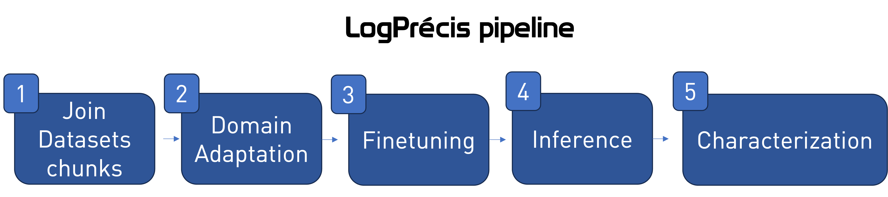

# LogPrécis

LogPrécis is a powerful tool designed to automate and enhance the workflow of security experts by leveraging the capabilities of Language Models (LMs). With LogPrécis, you can efficiently analyze and extract valuable information from large-scale log data, significantly improving your incident response and threat-hunting processes.

## Features

- **Automated Log Analysis** LogPrécis utilizes advanced LMs to automatically analyze and process vast amounts of log data. It can understand and interpret log entries, allowing for the effective identification of security incidents, anomalies, and patterns.

- **Precise Log Summarization** The tool provides concise and accurate log fingerprints, extracting essential details from lengthy log entries. By condensing log information, LogPrécis enables security experts to quickly grasp the key insights and focus on critical security events.

- **Visualization and Reporting**: LogPrécis offers interactive visualizations and customizable reports to present log analysis results in a meaningful way. Visual representations help in identifying trends, outliers, and patterns, while reports aid in communicating findings and recommendations to stakeholders.

## Getting Started

1. Clone the LogPrécis repository to your local machine:

```shell
git clone https://github.com/SmartData-Polito/logprecis.git
```

2. Install the required dependencies:

```shell
pip install -r requirements.txt
```

## Howto - Reproducibility


It also explains how you should access the code.

**Notice**: while, if you don't have you're own inference data, you cannot skip the first point of the pipeline (follow the `README` at `1.Dataset/Inference/`), you can already leverage both the domain adapted and finetuned models. Those are available on Huggingface:

- Domain adapted (step 2): [SmartDataPolito/SecureShellBert](https://huggingface.co/SmartDataPolito/SecureShellBert)
- Finetuned for intent detection (step 3): [SmartDataPolito/logprecis](https://huggingface.co/SmartDataPolito/logprecis)

To load those models, simply use their names when running the scripts at `2.Training/supervised_training/` setting the parameter `model_name`.

## Contact

If you have any questions, feedback, or suggestions regarding LogPrécis, feel free to reach out to our team at [matteo.boffa@polito.it](mailto:matteo.boffa@polito.it) and [idilio.drago@unito.it](mailto:idilio.drago@unito.it).

LogPrécis is an invaluable tool that empowers security experts to harness the full potential of Language Models for log analysis. By automating log processing and providing precise summaries, LogPrécis helps security teams stay one step ahead in the ever-evolving threat landscape. Start leveraging LogPrécis today and streamline your security operations like never before!
